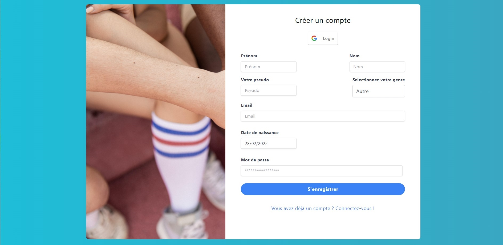
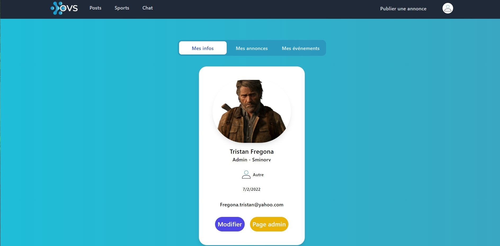
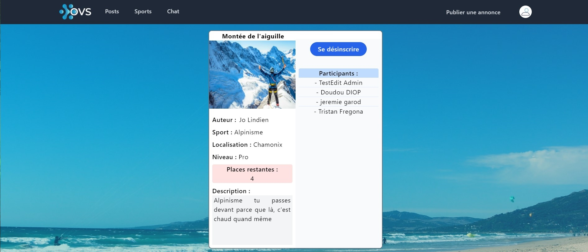

# On Va Sporter

OVS is our final EPITECH school project at Coding Academy, the goal is to create a web app and an API in MERN method.
 
OVS is dedicated to those looking for sports partner. 

# Requirements

For use OVS you have to start the API.

For more details check Api and OVS README in each repository.

## App Preview

### Homepage

  

All the 'read' part of the application is accessible for non-connected users

### Sports page

Display all sports in the data base

  

### Sign up and sign in

  

### Profile page

With a link to admin page for administrator users only

  

User can see his posts

  

And the events where he is inscribed 

  

The user can also update his profile

  

And his avatar

  

### Admin page

Administrators can create, read, update, delete any data : sports, posts, users

  

  

### Chat

  

### Create a post

  

### Dynamic page for each post

User can subscribe to an event

  

And if he is already subscribed, he can unsubscribe

  

## Authors

- [DIOP Doudou](https://github.com/Douzdiop)
- [FREGONA Tristan](https://github.com/Tfregona)
- [GABILLOUX Jérôme](https://github.com/jgabilloux)
- [GAROD Jeremie](https://github.com/JeremieG06)
- [PEREIRA-VARELA Jessy](https://github.com/Jessy06)
- [SULON Adrien](https://github.com/asulon1)
